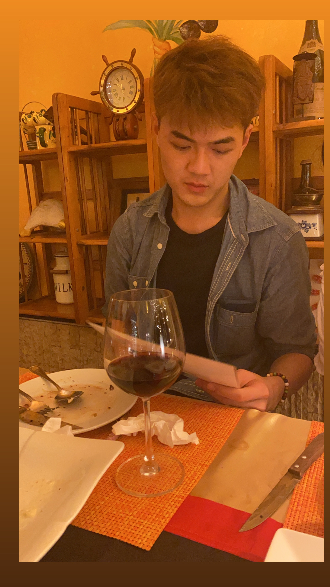

Hi all, I am Season Poon, I have a fun name - spoon, which you can also call me in this way. I am currently working as MLOps Engineer. I love to do cuda programming and solving problems, still actively learning everything about it, and recently I decided to share my learning journey here, and I am glad you would read it and learn alognside me :)!

[gh-site]: https://pages.github.com/
[minima]: https://github.com/jekyll/minima/tree/2.5-stable
[jk]: https://jekyllrb.com/
[gh]: https://help.github.com/en/github/working-with-github-pages`